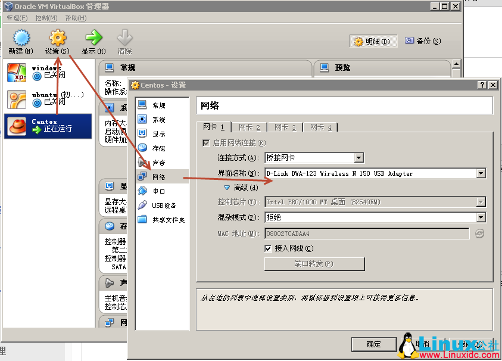
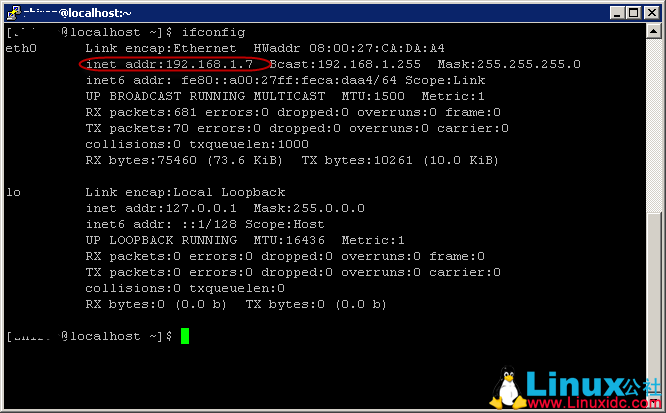
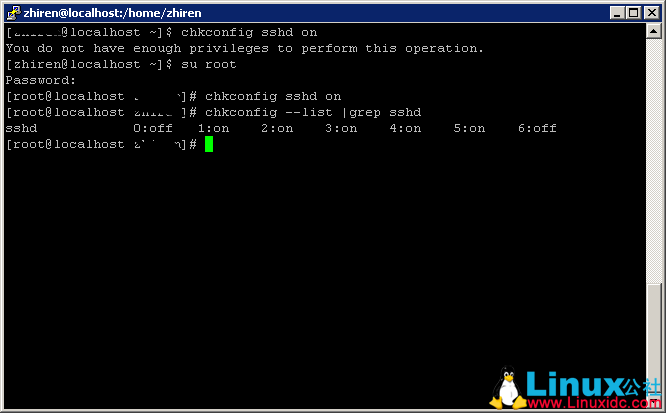
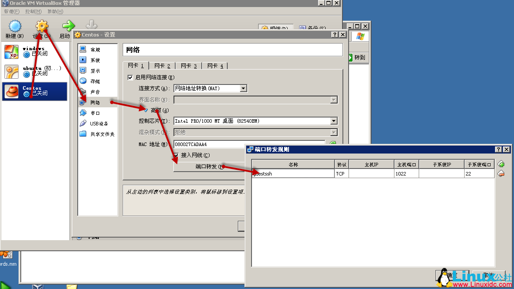
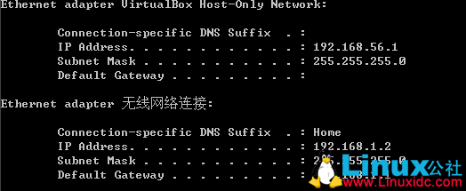
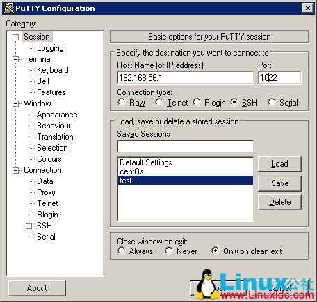

@(Linux_tech)
#linux VirtualBox中开启SSH（CentOS）
>主要包括以下及步骤：
1. 切换虚拟机的网络模式。
2. 设置sshd服务自启动。
3. 启动sshd服务。
4. 通过Putty连接。
5. 过程中遇到的问题。

　　由于是SSH和虚拟机共用一台机器，所以安装好CentOS后一时摸不准连接的IP应该是什么。由于VirtualBox默认是NAT（网络地址转换）的，所以虽然通过在宿主机器上ipconfig看到了虚拟网卡的IP但是一直也无法连到虚拟机上去（好像是要修改VirtualBox的转发规则，这个后面尝试）。最终通过修改网络连接方式位桥接（Bridge Adapter）的方式，直接把网卡地址给Centos用。
* 修改步骤：关闭虚拟机，在管理界面选择虚拟机-->设置-->网络：

* 设置后在CentOS终端就可以查看到当前IP地址了，ifconfig：

　　至此1部分打完收工，接下来设置sshd服务为自启动，这样就不用每次开机以后跑去虚拟机那端启动一次了。
使用命令：chkconfig sshd on 设置为开机启动
使用命令：chkconfig --list |grep sshd查看设置结果，注意这里需要root权限来设置。截图如下：

猜想一下列表中0~6应该代表的是Linux的运行模式。

接下来3启动sshd，这个没啥好说默认22端口的话直接使用命令：service sshd start 即可。

然后是4通过ssh工具，这里是putty连接即可。在CentOS中默认情况下iptables的策略是ACCEPT的所以不需要设置了。

>遇到的问题：
遇到的最大的问题应该就是虚拟机中IP找不准，做了很多尝试和google，一度停了netfilter组件（即iptables）。
其次，虽然CentOS中iptables规则默认是ACCEPT，但是实际场景多安全起见多少在INPUT、OUTPUT中选择DROP。这样急需要添加一条开发22端口的命令：
iptables -A INPUT -p tcp -m tcp -sport 22 -j ACCEPT
iptables -A OUTPUT -p tcp -m tcp -dport 22 -j ACCEPT

 

--------------------------------------------------------
补充一个后记：
尝试了一下原来不需要切换网络方式的，直接Nat就可以。从VirtualBox帮助中找到一段关于网络的介绍，其中NAT的模式类似于家里的物理路由器只不过这次路由器是VirtualBox的路由引擎，它将虚拟机和外界隔离开了，只需要设置下端口转发即可完成连接到制定虚拟机端口的目的，其最终效果就是对于所有发到VirtualBox的虚拟网卡IP指定端口的消息都转发到对应端口，这里需要的是22。设置如下：
1. 关闭虚拟机后设置网络为NAT并添加端口转发规则：

2. 直接连接到virtualBox的虚拟网卡的对应端口上，通过宿主机器的ipconfig可以查看到我的virtualBox当前ip为：192.168.56.1@1022：

3. 打完收工。连接正常。

